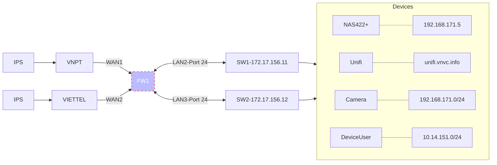
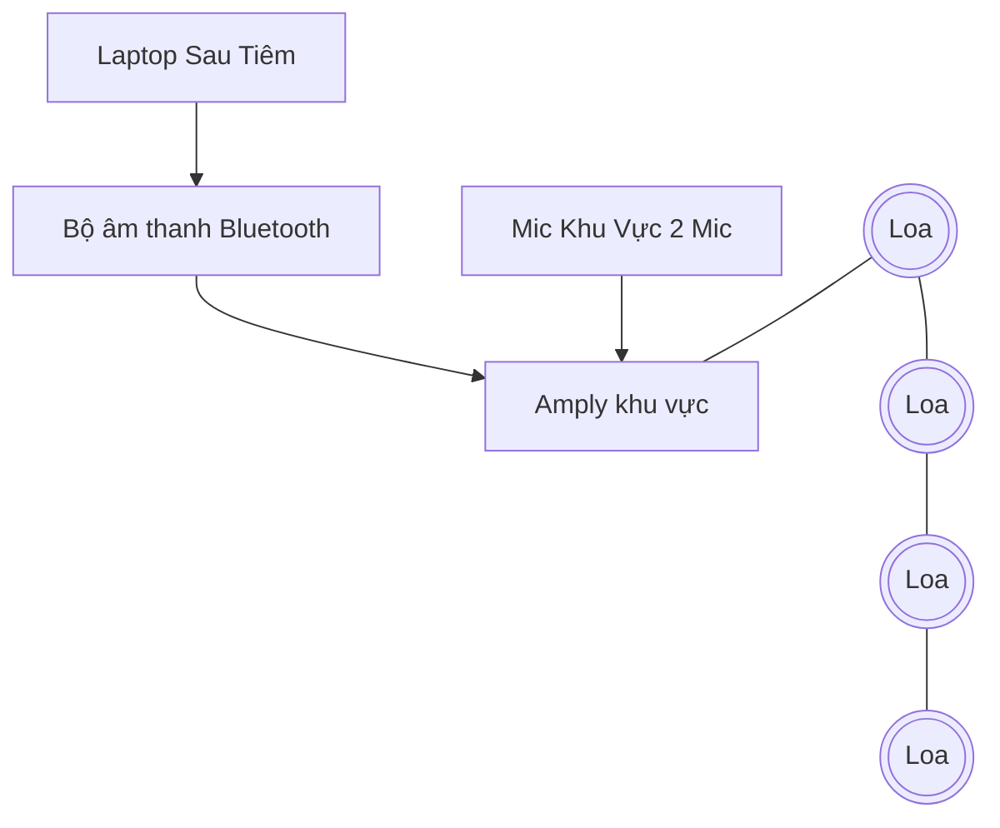

# VNVC PHONG PHUS
# Sơ Đồ bản vẽ Mạng LAN

# Sơ Đồ Hệ Thống Mạng


# Hệ Thống Âm Thanh


# Sơ Đồ Panel

## Panel 1
| PI | 1 | 2       | 3  | 4  | 5       | 6      | 7       | 8      | 9  | 10     | 11      | 12         | 13     | 14 | 15 | 16 | 17 | 18 | 19 | 20 | 21 | 22 | 23 | 24 | 25 | 26 | 27      | 28      | 29  | 30 | 31        | 32     | 33     | 34 | 35      | 36 | 37  | 38  | 39          | 40       | 41 | 42 | 43    | 44  | 45 | 46 | 47     | 48  |
|----|---|---------|----|----|---------|--------|---------|--------|----|--------|---------|------------|--------|----|----|----|----|----|----|----|----|----|----|----|----|----|---------|---------|-----|----|-----------|--------|--------|----|---------|----|-----|-----|-------------|----------|----|----|-------|-----|----|----|--------|-----|
| NO | 1 | 47      | 76 | 46 | 40      | 32     | 45      | 35     | 25 | 8      | 52      | 11         | 10     |    |    |    |    |    |    |    |    |    |    |    | 81 | 84 | 78      | 77      | 211 | 68 | 14        | 79     | 27     | 12 | 83      | 48 | 214 | 214 | 9           | 75       | 80 | 82 | 15    | 210 | 14 | 13 | 22     | 209 |
| TO |   | PC-TN02 |    |    | Ca-sảnh | TV-PK2 | PC-TN01 | TV-KVC |    | WF-KVC | PC-K1-2 | CA-SÂN SAU | CA-KVC |    |    |    |    |    |    |    |    |    |    |    |    |    | PC-VP03 | PC-VP01 |     |    | Ca.Server | MÁY IN | WF-VP  |    | PC-VP02 |    |     |     | CA-KHO LẠNH | KHO LẠNH |    |    | Ca.VP |     |    |    | WF-PK1 |     |
| SW |   | SW1-18  |    |    |         | SW2-9  | SW1-17  | SW2-12 |    | Sw1-02 | SW1-20  | SW2-5      | SW2-4  |    |    |    |    |    |    |    |    |    |    |    |    |    | SW2-16  | SW2-14  |     |    | Sw2-6     | SW2-17 | SW2-02 |    | SW2-15  |    |     |     | SW2-3       | SW2-20   |    |    | Sw2-7 |     |    |    | FW-02  |


## Panel 2
| PII | 1  | 2       | 3      | 4       | 5   | 6      | 7  | 8   | 9  | 10    | 11 | 12      | 13    | 14 | 15      | 16  | 17 | 18     | 19 | 20 | 21 | 22     | 23  | 24 | 25     | 26     | 27 | 28     | 29      | 30          | 31     | 32  | 33 | 34 | 35 | 36     | 37          | 38     | 39  | 40      | 41    | 42     | 43 | 44 | 45 | 46     | 47     | 48  |
|-----|----|---------|--------|---------|-----|--------|----|-----|----|-------|----|---------|-------|----|---------|-----|----|--------|----|----|----|--------|-----|----|--------|--------|----|--------|---------|-------------|--------|-----|----|----|----|--------|-------------|--------|-----|---------|-------|--------|----|----|----|--------|--------|-----|
| NO  | 49 | 55      | 59     | 51      | 207 | 41     | 54 | 204 | 50 | 21    | 42 | 200     | 6     | 58 | 43      | 208 | 62 | 57     | 63 | 65 | 44 | 205    | 201 | 60 | 31     | 33     | 53 | 34     | 7       | 2           | 69     | 203 | 70 | 74 | 73 | 61     | 24          | 26     | 206 | 23      | 71    | 4      | 72 | 64 | 5  | 67     | 66     | 202 |
| TO  |    | PC-K2-1 | PC-T2  | PC-K1-1 |     | PC-LT1 |    |     |    | CA.TV |    | PC-K2-2 | CA-TN |    | PC-LT02 |     |    | PC-T1  |    |    |    | MCC    |     |    | TV-PK1 | TV-PT1 |    | TV-PT2 | CA-TDST | CA- cửa trc | PC-PH  |     |    |    |    | CA-PT1 | WF trước PH | WF- PH |     | WF- PT1 | Ca.PH | CA- LT |    |    |    | CA-PT2 | CA-PT2 |     |
| SW  |    | SW1-21  | SW2-13 | SW1-19  |     | SW1-15 |    |     |    | SW1-5 |    | SW1-22  | SW1-7 |    | SW1-16  |     |    | SW1-23 |    |    |    | SW2-19 |     |    | Sw2-8  | SW2-10 |    | SW2-11 | SW1-08  | Sw1-03      | SW2-18 |     |    |    |    | SW1-10 | Sw1-01      | SW2-1  |     | FW-03   | Sw1-9 | SW1-6  |    |    |    | SW1-12 | SW1-11 |


# IP Ranger & Vlan

## Internet

| STT | ISP          | IP WAN         |  ACCOUT         | PASSWORD
| --- | -----------  | -------------  |-----------------|----------|
| 1   | VNPT1(WAN1)  | 113.161.243.174 | vacxin.tiengiang| 123456|
| 2   | VNPT2(WAN2)  | 123.25.238.155  | vacxin.tiengiang86     | 123456|

## IP Ranger

| Vlan Name     | IP Ranger        | Port on SW-1  | Port on SW-2 | 
| ------------- | ---------------- | ------------  |--------------| 
| Core          | 172.17.156.0/24  | 1-2           | 1-2          | 
| Camera & Tivi | 192.168.171.0/24 | 3-14          | 3-14         | 
| Vlan5         | 10.14.151.0/24   | 15-23         | 15-23        | 
| Wifi          | 172.15.10.0/24   |               |              |   
| Wifi- Public  | 192.168.100.0/22 |               |              |              

# Wifi & Camera

## Wifi

 | STT | Name             | IP            |
 | --- | ---------------- | ------------- |
 | 1   | 01. Tư vấn       | 172.17.156.51 |
 | 2   | 02. Thu ngân     | 172.17.156.50 |
 | 3   | 03. Tiêm 2       | 172.17.156.53 |
 | 4   | 04. Khu vui chơi | 172.17.156.55 |
 | 5   | 05. Phòng Họp    | 172.17.134.54 |
 | 6   | 06. VĂN PHÒNG    | 172.17.134.52 |


## Camera
 | STT | Name             | IP Address     |
 | --- | --------------   | -------------- |
 | 1   | KHO LẠNH         | 192.168.171.11 |
 | 2   | KHU VUI CHƠI     | 192.168.171.12 |
 | 3   | CỬA SAU          | 192.168.171.13 |
 | 4   | TDST             | 192.168.171.14 |
 | 5   | THU NGÂN         | 192.168.171.15 |
 | 6   | TƯ VẤN           | 192.168.171.16 |
 | 7   | LỄ TÂN           | 192.168.171.17 |
 | 8   | VĂN PHÒNG        | 192.168.171.18 |
 | 9   | CỬA CHÍNH        | 192.168.171.19 |
 | 10  | SERVER           | 192.168.171.20 |
 | 11  | SẢNH             | 192.168.171.21 |
 | 12  | PHÒNG TIÊM 2     | 192.168.171.24 |
 | 13  | PHÒNG TIÊM 2-PUST| 192.168.171.25 |
 | 14  | PHÒNG TIÊM 1     | 192.168.171.26 |
 | 15  | PHÒNG HỌP        | 192.168.171.31 |
 

# EXT IP Phone
| STT | Extension | Password                         | Host           | IP Phone     | Vị trí     |
|-----|-----------|----------------------------------|----------------|--------------|------------|
| 1   | 41701     |iE3?.e..EN                        | pbx.vnvc.info  |              | LT         |
| 2   | 41702     |VQVLLA5^!Y                        | pbx.vnvc.info  |              | TN         |
| 3   | 41703     |2Gn2Bb.rRa                        | pbx.vnvc.info  |              | PK1        |
| 4   | 41704     |pPB!.WCF.6                        | pbx.vnvc.info  |              | PK2        |
| 5   | 41705     |q.3LYp?Me!                        | pbx.vnvc.info  |              | PUST        |
| 6   | 41706     |YUwYTRhEI.                        | pbx.vnvc.info  |              | VP         |
| 7   | 1727      | a0152626e99a8df34204911495711660 | pbx2.vnvc.info |              | BS         |
| 8   | 1728      | 10718ee3ccbf91381863d489e9f746ec | pbx2.vnvc.info |              | PK2-oncall |

# Switch Config
## Switch 01
```
conf ter
interface GigabitEthernet1/0/24
switchport mode trunk
switchport trunk native vlan 2
switchport trunk allow vlan all
exit
vlan 2
name MGMT
vlan 100
name WIFI
vlan 101
name WIFI-PUBLIC
vlan 99
name CAMERA
vlan 5
name PK-PT
vlan 201
name ISP1
vlan 202
name ISP2
!
!
port-channel load-balance src-dst-ip
hostname SW-9200-1
username admin privilege 15 password "password"
aaa new-model
aaa authentication login default local
aaa authorization exec default local 
aaa authorization network default local 
aaa session-id common
ip domain-name tanhiep.vnvc.vn
interface Vlan1
 no ip address
 shutdown
!
interface Vlan2
 ip address 172.17.156.11 255.255.255.0
!
ip default-gateway 172.17.156.1
ip http server
ip http secure-server
!
ip ssh version 2
!
line con 0
line vty 5 15
!
interface range GigabitEthernet1/0/1-2
switchport mode trunk
switchport trunk native vlan 2
switchport trunk allow vlan all
!
interface range GigabitEthernet1/0/3-14
switchport mode access
switchport access vlan 99
! 
interface range GigabitEthernet1/0/15-23
switchport mode access
switchport access vlan 5
!

end
copy run star
```
## Switch 02
 ```
conf ter
interface GigabitEthernet1/0/24
switchport mode trunk
switchport trunk native vlan 2
switchport trunk allow vlan all
exit
vlan 2
name MGMT
vlan 100
name WIFI
vlan 101
name WIFI-PUBLIC
vlan 99
name CAMERA
vlan 5
name PK-PT
vlan 201
name ISP1
vlan 202
name ISP2
!
!
port-channel load-balance src-dst-ip
hostname SW-9200-2
username admin privilege 15 password VT@$14
aaa new-model
aaa authentication login default local
aaa authorization exec default local 
aaa authorization network default local 
aaa session-id common
ip domain name tanhiep.vnvc.vn
interface Vlan1
 no ip address
 shutdown
!
interface Vlan2
 ip address 172.17.156.12 255.255.255.0
!
ip default-gateway 172.17.156.1
ip http server
ip http secure-server
!
ip ssh version 2
!
line con 0
line vty 5 15
!
interface range GigabitEthernet1/0/1-2
switchport mode trunk
switchport trunk native vlan 2
switchport trunk allow vlan all
!
interface range GigabitEthernet1/0/3-12
switchport mode access
switchport access vlan 99
! 
interface range GigabitEthernet1/0/13-23
switchport mode access
switchport access vlan 5
!

end
copy run star
```
